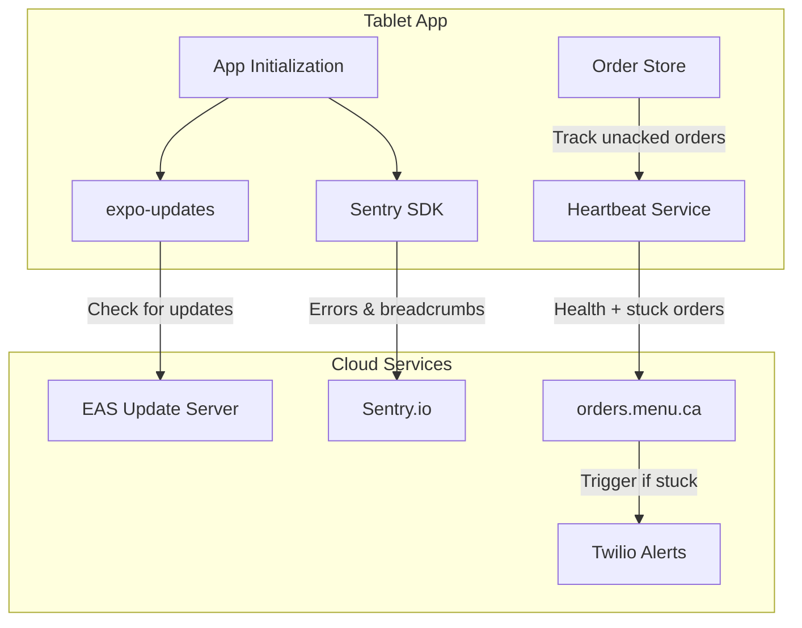

# Remote Updates, Crash Reporting, and Stuck Order Detection

This specification adds three critical capabilities to the tablet app:

1. **EAS Update (OTA)** - Push JavaScript fixes without Play Store
2. **Sentry** - Remote crash and error visibility
3. **Stuck Order Detection** - Proactive alerts for unacknowledged orders

---

## Architecture Overview




---

## Phase 1: EAS Update (OTA Updates)

### 1.1 Install Dependencies

Add to [package.json](package.json):

```json
"expo-updates": "~0.29.10"
```

**Critical:** Version must match Expo SDK 54. Wrong version causes native crashes.

### 1.2 Configure app.json

Add to [app.json](app.json) under `expo`:

```json
{
  "expo": {
    "runtimeVersion": {
      "policy": "appVersion"
    },
    "updates": {
      "enabled": true,
      "checkAutomatically": "ON_LOAD",
      "fallbackToCacheTimeout": 5000,
      "url": "https://u.expo.dev/a8b29fb9-0480-49fb-b993-b008bfb974bf"
    }
  }
}
```

**Why these values:**

- `runtimeVersion.policy: "appVersion"` - Updates tied to app version (1.3.x). Native code changes require new build.
- `checkAutomatically: "ON_LOAD"` - Checks on app start (not background - saves battery)
- `fallbackToCacheTimeout: 5000` - If no update found in 5s, use cached bundle (prevents slow starts)

### 1.3 Configure eas.json

Update [eas.json](eas.json) with channels:

```json
{
  "build": {
    "development": {
      "developmentClient": true,
      "distribution": "internal",
      "channel": "development"
    },
    "preview": {
      "distribution": "internal",
      "channel": "preview"
    },
    "production": {
      "distribution": "store",
      "android": {
        "buildType": "app-bundle"
      },
      "channel": "production"
    }
  }
}
```

### 1.4 Create Update Hook

New file: `src/hooks/useAppUpdates.ts`

```typescript
import { useEffect, useCallback, useState } from 'react';
import * as Updates from 'expo-updates';
import { AppState, AppStateStatus, Alert } from 'react-native';

interface UpdateState {
  isChecking: boolean;
  isDownloading: boolean;
  updateAvailable: boolean;
  error: string | null;
}

export const useAppUpdates = () => {
  const [state, setState] = useState<UpdateState>({
    isChecking: false,
    isDownloading: false,
    updateAvailable: false,
    error: null,
  });

  const checkForUpdate = useCallback(async (silent = false) => {
    // Skip in development mode
    if (__DEV__) {
      console.log('[Updates] Skipping check in dev mode');
      return;
    }

    try {
      setState(s => ({ ...s, isChecking: true, error: null }));
      console.log('[Updates] Checking for updates...');
      
      const update = await Updates.checkForUpdateAsync();
      
      if (update.isAvailable) {
        console.log('[Updates] Update available, downloading...');
        setState(s => ({ ...s, isChecking: false, isDownloading: true, updateAvailable: true }));
        
        await Updates.fetchUpdateAsync();
        
        console.log('[Updates] Update downloaded, reloading...');
        setState(s => ({ ...s, isDownloading: false }));
        
        // Auto-reload for tablet kiosk mode (no user prompt)
        await Updates.reloadAsync();
      } else {
        console.log('[Updates] App is up to date');
        setState(s => ({ ...s, isChecking: false, updateAvailable: false }));
      }
    } catch (error) {
      const message = error instanceof Error ? error.message : 'Unknown error';
      console.error('[Updates] Check failed:', message);
      setState(s => ({ ...s, isChecking: false, isDownloading: false, error: message }));
      
      // Don't alert in silent mode (background checks)
      if (!silent) {
        // Log to Sentry if available
        console.error('[Updates] Update check failed:', error);
      }
    }
  }, []);

  // Check on app start
  useEffect(() => {
    checkForUpdate(true);
  }, [checkForUpdate]);

  // Check when app comes to foreground
  useEffect(() => {
    const handleAppStateChange = (nextState: AppStateStatus) => {
      if (nextState === 'active') {
        checkForUpdate(true);
      }
    };

    const subscription = AppState.addEventListener('change', handleAppStateChange);
    return () => subscription.remove();
  }, [checkForUpdate]);

  return {
    ...state,
    checkForUpdate,
  };
};
```

**Safety considerations:**

- `__DEV__` check prevents crashes in development
- Silent mode for background checks (no user alerts)
- Auto-reload for kiosk tablets (no confirmation needed)
- Try/catch prevents update failures from crashing app

### 1.5 Integrate in App.tsx

Update [App.tsx](App.tsx):

```typescript
import { useAppUpdates } from './src/hooks/useAppUpdates';

const AppContent: React.FC = () => {
  const { themeMode } = useTheme();

  // Check for OTA updates on app start and foreground
  useAppUpdates();

  // Keep screen on at all times
  useKeepAwake();

  // ... rest unchanged
};
```

### 1.6 Update Hook Exports

Add to [src/hooks/index.ts](src/hooks/index.ts):

```typescript
export { useAppUpdates } from './useAppUpdates';
```

---

## Phase 2: Sentry Error Reporting

### 2.1 Install Dependencies

Add to [package.json](package.json):

```json
"@sentry/react-native": "~6.5.0"
```

**Note:** Must use version compatible with Expo SDK 54 and React Native 0.81.

### 2.2 Configure Sentry

New file: `src/config/sentry.ts`

```typescript
import * as Sentry from '@sentry/react-native';

const SENTRY_DSN = 'YOUR_SENTRY_DSN_HERE'; // Will be provided by user

export const initSentry = () => {
  if (__DEV__) {
    console.log('[Sentry] Skipping initialization in dev mode');
    return;
  }

  Sentry.init({
    dsn: SENTRY_DSN,
    
    // Performance monitoring (sample 20% of transactions)
    tracesSampleRate: 0.2,
    
    // Environment based on updates channel
    environment: __DEV__ ? 'development' : 'production',
    
    // App version for tracking
    release: 'ca.menu.orders@1.3.0',
    
    // Don't send PII
    sendDefaultPii: false,
    
    // Attach device context
    attachStacktrace: true,
    
    // Filter out non-actionable errors
    beforeSend(event) {
      // Filter network errors that are expected (offline mode)
      if (event.exception?.values?.[0]?.value?.includes('Network request failed')) {
        return null;
      }
      return event;
    },
  });
};

// Helper to set user context (restaurant info)
export const setSentryContext = (restaurantId: string, restaurantName: string, deviceName: string) => {
  Sentry.setUser({
    id: restaurantId,
  });
  Sentry.setTag('restaurant_name', restaurantName);
  Sentry.setTag('device_name', deviceName);
};

// Helper to add breadcrumb
export const addBreadcrumb = (message: string, category: string, data?: Record<string, any>) => {
  Sentry.addBreadcrumb({
    message,
    category,
    data,
    level: 'info',
  });
};

// Helper to capture exception
export const captureException = (error: Error, context?: Record<string, any>) => {
  if (context) {
    Sentry.withScope((scope) => {
      scope.setExtras(context);
      Sentry.captureException(error);
    });
  } else {
    Sentry.captureException(error);
  }
};

export { Sentry };
```

### 2.3 Create Error Boundary

New file: `src/components/ErrorBoundary.tsx`

```typescript
import React from 'react';
import { View, Text, TouchableOpacity, StyleSheet } from 'react-native';
import * as Sentry from '@sentry/react-native';
import * as Updates from 'expo-updates';

interface Props {
  children: React.ReactNode;
}

interface State {
  hasError: boolean;
  error: Error | null;
}

export class ErrorBoundary extends React.Component<Props, State> {
  constructor(props: Props) {
    super(props);
    this.state = { hasError: false, error: null };
  }

  static getDerivedStateFromError(error: Error): State {
    return { hasError: true, error };
  }

  componentDidCatch(error: Error, errorInfo: React.ErrorInfo) {
    console.error('[ErrorBoundary] Caught error:', error);
    
    // Report to Sentry with component stack
    Sentry.withScope((scope) => {
      scope.setExtra('componentStack', errorInfo.componentStack);
      Sentry.captureException(error);
    });
  }

  handleReload = async () => {
    try {
      // Try to reload with latest update
      if (!__DEV__) {
        await Updates.reloadAsync();
      }
    } catch {
      // Fallback: just reset state
      this.setState({ hasError: false, error: null });
    }
  };

  render() {
    if (this.state.hasError) {
      return (
        <View style={styles.container}>
          <Text style={styles.title}>Something went wrong</Text>
          <Text style={styles.message}>
            The app encountered an error. This has been reported automatically.
          </Text>
          <TouchableOpacity style={styles.button} onPress={this.handleReload}>
            <Text style={styles.buttonText}>Reload App</Text>
          </TouchableOpacity>
        </View>
      );
    }

    return this.props.children;
  }
}

const styles = StyleSheet.create({
  container: {
    flex: 1,
    justifyContent: 'center',
    alignItems: 'center',
    backgroundColor: '#1a1a2e',
    padding: 40,
  },
  title: {
    fontSize: 24,
    fontWeight: 'bold',
    color: '#ffffff',
    marginBottom: 16,
  },
  message: {
    fontSize: 16,
    color: '#a0a0a0',
    textAlign: 'center',
    marginBottom: 32,
  },
  button: {
    backgroundColor: '#3b82f6',
    paddingHorizontal: 32,
    paddingVertical: 16,
    borderRadius: 8,
  },
  buttonText: {
    color: '#ffffff',
    fontSize: 16,
    fontWeight: '600',
  },
});
```

### 2.4 Update App.tsx with Sentry

Update [App.tsx](App.tsx):

```typescript
import React, { useEffect } from 'react';
import { LogBox } from 'react-native';
import { StatusBar } from 'expo-status-bar';
import { SafeAreaProvider } from 'react-native-safe-area-context';
import { useKeepAwake } from 'expo-keep-awake';
import { AppNavigator } from './src/navigation/AppNavigator';
import { useNetworkStatus, useOrderNotifications, useHeartbeat, useAppUpdates } from './src/hooks';
import { ThemeProvider, useTheme } from './src/theme';
import { ErrorBoundary } from './src/components/ErrorBoundary';
import { initSentry, setSentryContext, addBreadcrumb } from './src/config/sentry';
import { useStore } from './src/store/useStore';

// Initialize Sentry early, before any React code
initSentry();

// Hide warning messages for demo/production
LogBox.ignoreAllLogs(true);

const AppContent: React.FC = () => {
  const { themeMode } = useTheme();
  const { auth } = useStore();

  // Check for OTA updates
  useAppUpdates();

  // Keep screen on
  useKeepAwake();

  // Network, notifications, heartbeat
  useNetworkStatus();
  useOrderNotifications();
  useHeartbeat();

  // Set Sentry context when authenticated
  useEffect(() => {
    if (auth.isAuthenticated && auth.restaurantId) {
      setSentryContext(
        auth.restaurantId,
        auth.restaurantName || 'Unknown',
        auth.deviceName || 'Unknown'
      );
      addBreadcrumb('User authenticated', 'auth', { restaurantId: auth.restaurantId });
    }
  }, [auth.isAuthenticated, auth.restaurantId, auth.restaurantName, auth.deviceName]);

  return (
    <>
      <StatusBar style={themeMode === 'dark' ? 'light' : 'dark'} />
      <AppNavigator />
    </>
  );
};

export default function App() {
  return (
    <SafeAreaProvider>
      <ThemeProvider>
        <ErrorBoundary>
          <AppContent />
        </ErrorBoundary>
      </ThemeProvider>
    </SafeAreaProvider>
  );
}
```

### 2.5 Add Breadcrumbs to Key Actions

Update [src/store/useStore.ts](src/store/useStore.ts) - add imports and breadcrumbs:

```typescript
import { addBreadcrumb, captureException } from '../config/sentry';

// In fetchOrders:
addBreadcrumb('Fetching orders', 'api');

// In updateOrderStatus:
addBreadcrumb('Updating order status', 'order', { orderId, newStatus: status });

// In error catches:
captureException(error, { context: 'fetchOrders' });
```

### 2.6 Add Breadcrumbs to API Client

Update [src/api/client.ts](src/api/client.ts):

```typescript
import { addBreadcrumb, captureException } from '../config/sentry';

// In request interceptor:
addBreadcrumb(`API Request: ${config.method?.toUpperCase()} ${config.url}`, 'http');

// In response interceptor error handler:
captureException(error, { endpoint: error.config?.url, status: error.response?.status });
```

---

## Phase 3: Stuck Order Detection

### 3.1 Update HeartbeatPayload Type

Update [src/types/index.ts](src/types/index.ts):

```typescript
export interface HeartbeatPayload {
  battery_level?: number;
  wifi_strength?: number;
  printer_status?: 'connected' | 'disconnected' | 'error';
  app_version: string;
  last_order_received?: string;
  // NEW: Stuck order detection
  stuck_orders?: StuckOrderInfo[];
}

// NEW: Stuck order information
export interface StuckOrderInfo {
  order_id: string;
  order_number: string;
  status: OrderStatus;
  minutes_stuck: number;
  created_at: string;
}
```

### 3.2 Create Stuck Order Detection Utility

New file: `src/utils/stuckOrderDetection.ts`

```typescript
import { Order, OrderStatus, StuckOrderInfo } from '../types';

// Thresholds for different statuses (in minutes)
const STUCK_THRESHOLDS: Partial<Record<OrderStatus, number>> = {
  pending: 5,      // New order not acknowledged after 5 min
  confirmed: 15,   // Confirmed but not preparing after 15 min
  preparing: 30,   // Preparing for more than 30 min
  ready: 20,       // Ready but not picked up after 20 min
};

/**
 * Detects orders that have been in the same status for too long
 */
export const detectStuckOrders = (orders: Order[]): StuckOrderInfo[] => {
  const now = Date.now();
  const stuckOrders: StuckOrderInfo[] = [];

  for (const order of orders) {
    const threshold = STUCK_THRESHOLDS[order.status];
    
    // Skip statuses we don't track
    if (!threshold) continue;
    
    // Calculate time in current status
    const statusTime = new Date(order.updated_at || order.created_at).getTime();
    const minutesInStatus = Math.floor((now - statusTime) / 60000);
    
    if (minutesInStatus >= threshold) {
      stuckOrders.push({
        order_id: order.id,
        order_number: order.order_number,
        status: order.status,
        minutes_stuck: minutesInStatus,
        created_at: order.created_at,
      });
    }
  }

  // Sort by most stuck first
  return stuckOrders.sort((a, b) => b.minutes_stuck - a.minutes_stuck);
};
```

### 3.3 Update useHeartbeat Hook

Update [src/hooks/useHeartbeat.ts](src/hooks/useHeartbeat.ts):

```typescript
import { detectStuckOrders } from '../utils/stuckOrderDetection';

// Inside sendHeartbeat callback:
const sendHeartbeat = useCallback(async () => {
  if (!auth.isAuthenticated || !offline.isOnline) {
    console.log('[Heartbeat] Skipping - not authenticated or offline');
    return;
  }

  // Detect stuck orders from current order list
  const { orders } = useStore.getState().orders;
  const stuckOrders = detectStuckOrders(orders);
  
  if (stuckOrders.length > 0) {
    console.log('[Heartbeat] Detected stuck orders:', stuckOrders.length);
  }

  console.log('[Heartbeat] Sending heartbeat...');
  try {
    const response = await apiClient.sendHeartbeat({
      app_version: APP_VERSION,
      battery_level: 100,
      printer_status: settings.printerConnected ? 'connected' : 'disconnected',
      stuck_orders: stuckOrders.length > 0 ? stuckOrders : undefined,
    });
    // ... rest unchanged
  } catch (error) {
    // ... error handling
  }
}, [auth.isAuthenticated, offline.isOnline, settings.printerConnected]);
```

### 3.4 Update heartbeatService (Alternative Implementation)

Update [src/services/heartbeatService.ts](src/services/heartbeatService.ts):

```typescript
import { detectStuckOrders } from '../utils/stuckOrderDetection';

export const sendHeartbeat = async (): Promise<void> => {
  const store = useStore.getState();

  if (!store.auth.isAuthenticated || !store.offline.isOnline) {
    return;
  }

  // Detect stuck orders
  const stuckOrders = detectStuckOrders(store.orders.orders);

  const payload: HeartbeatPayload = {
    app_version: APP_VERSION,
    battery_level: await getBatteryLevel(),
    wifi_strength: await getWifiStrength(),
    printer_status: store.settings.printerConnected ? 'connected' : 'disconnected',
    stuck_orders: stuckOrders.length > 0 ? stuckOrders : undefined,
  };

  // Add last order received time if we have orders
  if (store.orders.orders.length > 0) {
    const latestOrder = store.orders.orders[0];
    payload.last_order_received = latestOrder.created_at;
  }

  // ... rest unchanged
};
```

---

## Phase 4: Post-Implementation Rebuild

### 4.1 Native Rebuild Required

After adding `expo-updates` and `@sentry/react-native`, a native rebuild is required:

```bash
# Clean and regenerate native code
rm -rf android ios
npx expo prebuild --clean

# Build new AAB for Play Store
cd android && ./gradlew bundleRelease
```

### 4.2 Version Bump

Update [android/app/build.gradle](android/app/build.gradle):

```gradle
versionCode 7
versionName "1.4.0"
```

Update [app.json](app.json):

```json
"version": "1.4.0"
```

---

## Testing Checklist

Before deployment, verify:

1. **OTA Updates**
  - App starts without crashes in production mode
  - Update check runs on app start (check logs)
  - Update check runs when app comes to foreground
  - `__DEV__` check prevents update checks in development
2. **Sentry**
  - Sentry initializes without errors
  - Error boundary catches and displays fallback UI
  - Breadcrumbs appear in Sentry dashboard
  - Restaurant context is set after login
3. **Stuck Orders**
  - Heartbeat includes `stuck_orders` when orders exceed thresholds
  - Stuck order detection respects status-specific thresholds
  - Empty array is not sent (undefined when no stuck orders)

---

## Files Summary


| File                               | Action | Purpose                                             |
| ---------------------------------- | ------ | --------------------------------------------------- |
| `package.json`                     | Modify | Add expo-updates, @sentry/react-native              |
| `app.json`                         | Modify | Add runtimeVersion, updates config                  |
| `eas.json`                         | Modify | Add channel to build profiles                       |
| `App.tsx`                          | Modify | Initialize Sentry, add ErrorBoundary, useAppUpdates |
| `src/hooks/useAppUpdates.ts`       | Create | OTA update checking hook                            |
| `src/hooks/index.ts`               | Modify | Export useAppUpdates                                |
| `src/config/sentry.ts`             | Create | Sentry configuration and helpers                    |
| `src/components/ErrorBoundary.tsx` | Create | React error boundary with Sentry                    |
| `src/types/index.ts`               | Modify | Add StuckOrderInfo type, extend HeartbeatPayload    |
| `src/utils/stuckOrderDetection.ts` | Create | Stuck order detection logic                         |
| `src/hooks/useHeartbeat.ts`        | Modify | Include stuck orders in heartbeat                   |
| `src/store/useStore.ts`            | Modify | Add Sentry breadcrumbs                              |
| `src/api/client.ts`                | Modify | Add Sentry breadcrumbs                              |


---

## Risk Mitigation

1. **expo-updates version mismatch**: Use exact version ~0.29.10 for SDK 54
2. **Sentry initialization failure**: Wrapped in try/catch, app continues without Sentry
3. **Update check failure**: Silent mode prevents user-facing errors
4. **Stuck order false positives**: Conservative thresholds, backend decides on alerts
5. **Performance impact**: Stuck order detection is O(n) on order array, runs every 60s

